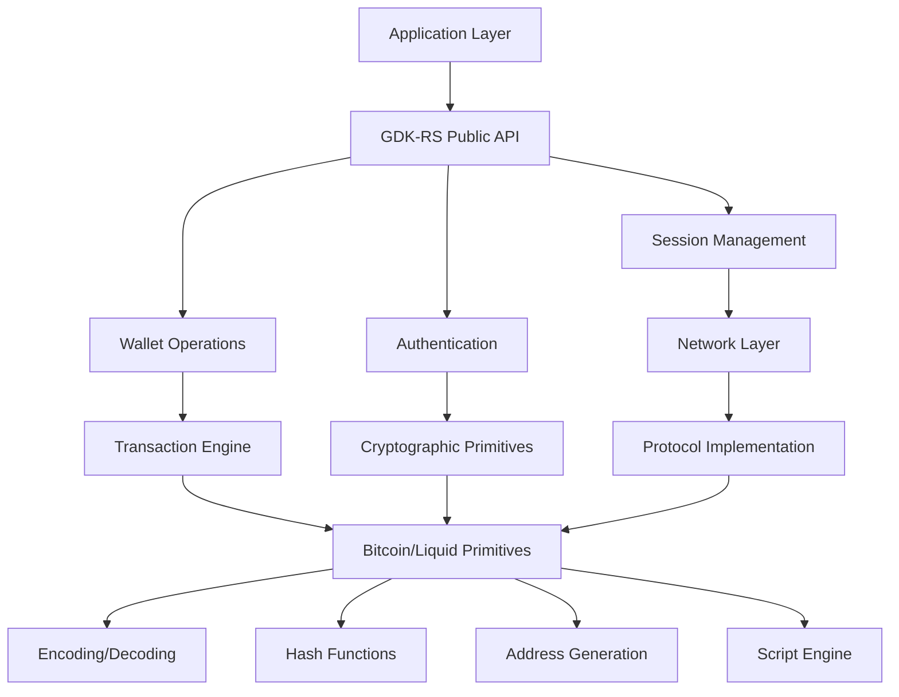

# Design Document

## Overview

The GDK Rust reimplementation is a comprehensive pure Rust library that provides all functionality of the original Blockstream Green Development Kit (GDK) without any C/C++ dependencies. The design follows a modular architecture that separates concerns into distinct layers: primitives (Bitcoin/Liquid protocol implementation), session management, wallet operations, network communication, and authentication.

The library is designed to be thread-safe, async-first, and idiomatic Rust, leveraging the type system for safety while maintaining API compatibility with the original GDK's functionality. Rather than depending on external crates like rust-bitcoin or rust-elements, we reimplement all Bitcoin and Liquid primitives internally to maintain full control over the implementation and ensure consistency.

## Architecture

### High-Level Architecture



### Layer Responsibilities

1. **Public API Layer**: Exposes the main GDK functions as idiomatic Rust APIs
2. **Session Management**: Handles connection lifecycle, notifications, and state management
3. **Wallet Operations**: Manages subaccounts, addresses, and wallet-specific functionality
4. **Authentication**: Handles user login, registration, and credential management
5. **Network Layer**: Manages connections to Green servers, Electrum servers, and Tor
6. **Transaction Engine**: Handles transaction creation, signing, and broadcasting
7. **Primitives Layer**: Core Bitcoin/Liquid protocol implementation

## Components and Interfaces

### Core Session Interface

```rust
pub struct Session {
    config: Arc<GdkConfig>,
    connection: Option<Connection>,
    notification_sender: broadcast::Sender<Notification>,
    wallet: Arc<Mutex<Option<Wallet>>>,
    network_params: Option<ConnectParams>,
}

impl Session {
    pub fn new(config: GdkConfig) -> Self;
    pub async fn connect(&mut self, params: &ConnectParams) -> Result<()>;
    pub async fn login(&self, credentials: &LoginCredentials) -> Result<RegisterLoginResult>;
    pub async fn register_user(&self, credentials: &LoginCredentials) -> Result<RegisterLoginResult>;
    pub fn subscribe(&self) -> broadcast::Receiver<Notification>;
    pub async fn disconnect(&mut self) -> Result<()>;
}
```

### Wallet Management Interface

```rust
pub struct Wallet {
    master_key: ExtendedPrivateKey,
    network: Network,
    subaccounts: HashMap<u32, Subaccount>,
}

impl Wallet {
    pub fn from_mnemonic(mnemonic: &str) -> Result<Self>;
    pub fn from_hardware_device(device: &HardwareDevice) -> Result<Self>;
    pub fn create_subaccount(&mut self, account_type: SubaccountType) -> Result<u32>;
    pub fn get_receive_address(&self, subaccount: u32) -> Result<Address>;
    pub fn get_previous_addresses(&self, subaccount: u32) -> Result<Vec<AddressInfo>>;
}
```

### Transaction Interface

```rust
pub struct TransactionBuilder {
    inputs: Vec<TxIn>,
    outputs: Vec<TxOut>,
    fee_rate: Option<u64>,
    network: Network,
}

impl TransactionBuilder {
    pub fn new(network: Network) -> Self;
    pub fn add_input(&mut self, outpoint: OutPoint, script_sig: Script) -> &mut Self;
    pub fn add_output(&mut self, value: u64, script_pubkey: Script) -> &mut Self;
    pub fn set_fee_rate(&mut self, fee_rate: u64) -> &mut Self;
    pub fn build(&self) -> Result<Transaction>;
}
```

### Network Communication Interface

```rust
pub struct Connection {
    websocket: WebSocketStream<MaybeTlsStream<TcpStream>>,
    notification_sender: broadcast::Sender<Notification>,
    pending_calls: Arc<Mutex<HashMap<String, oneshot::Sender<serde_json::Value>>>>,
}

impl Connection {
    pub async fn new(url: &str, notification_sender: broadcast::Sender<Notification>) -> Result<Self>;
    pub async fn call(&self, method: &str, params: serde_json::Value) -> Result<serde_json::Value>;
    pub async fn close(&mut self) -> Result<()>;
}
```

### Hardware Wallet Interface

```rust
pub trait HardwareWallet: Send + Sync {
    async fn get_master_xpub(&self) -> Result<ExtendedPublicKey>;
    async fn sign_transaction(&self, psbt: &PartiallySignedTransaction) -> Result<PartiallySignedTransaction>;
    async fn get_address(&self, derivation_path: &DerivationPath) -> Result<Address>;
    async fn display_address(&self, derivation_path: &DerivationPath) -> Result<bool>;
}
```

## Data Models

### Core Data Structures

```rust
// Configuration and Network Types
#[derive(Serialize, Deserialize, Debug, Clone)]
pub struct GdkConfig {
    pub data_dir: Option<PathBuf>,
    pub tor_dir: Option<PathBuf>,
    pub registry_dir: Option<PathBuf>,
    pub log_level: LogLevel,
    pub with_shutdown: bool,
}

#[derive(Serialize, Deserialize, Debug, Clone)]
pub struct ConnectParams {
    pub name: String,
    pub proxy: Option<String>,
    pub use_tor: bool,
    pub user_agent: Option<String>,
    pub spv_enabled: bool,
    pub min_fee_rate: Option<u64>,
    pub electrum_url: Option<String>,
    pub electrum_tls: bool,
}

// Authentication Types
#[derive(Serialize, Deserialize, Debug, Clone)]
pub struct LoginCredentials {
    pub mnemonic: Option<String>,
    pub password: Option<String>,
    pub bip39_passphrase: Option<String>,
    pub pin: Option<String>,
    pub pin_data: Option<PinData>,
    pub username: Option<String>, // for watch-only
    pub core_descriptors: Option<Vec<String>>, // for descriptor watch-only
}

// Transaction Types
#[derive(Serialize, Deserialize, Debug, Clone)]
pub struct CreateTransactionParams {
    pub subaccount: u32,
    pub addressees: Vec<Addressee>,
    pub fee_rate: Option<u64>,
    pub send_all: bool,
    pub utxos: Option<Vec<UnspentOutput>>,
}

#[derive(Serialize, Deserialize, Debug, Clone)]
pub struct Addressee {
    pub address: String,
    pub satoshi: u64,
    pub asset_id: Option<String>, // for Liquid
}
```

### Bitcoin/Liquid Primitives

```rust
// Core Bitcoin Types
#[derive(Serialize, Deserialize, Debug, Clone, PartialEq, Eq)]
pub struct Transaction {
    pub version: i32,
    pub lock_time: u32,
    pub input: Vec<TxIn>,
    pub output: Vec<TxOut>,
}

#[derive(Serialize, Deserialize, Debug, Clone, PartialEq, Eq)]
pub struct TxIn {
    pub previous_output: OutPoint,
    pub script_sig: Script,
    pub sequence: u32,
    pub witness: Vec<Vec<u8>>, // for SegWit
}

#[derive(Serialize, Deserialize, Debug, Clone, PartialEq, Eq)]
pub struct TxOut {
    pub value: u64,
    pub script_pubkey: Script,
}

// Liquid-specific Extensions
#[derive(Serialize, Deserialize, Debug, Clone, PartialEq, Eq)]
pub struct ConfidentialTxOut {
    pub asset: ConfidentialAsset,
    pub value: ConfidentialValue,
    pub nonce: ConfidentialNonce,
    pub script_pubkey: Script,
    pub witness: TxOutWitness,
}

#[derive(Serialize, Deserialize, Debug, Clone)]
pub struct Asset {
    pub asset_id: String,
    pub name: String,
    pub ticker: String,
    pub precision: u8,
    pub domain: Option<String>,
}
```

## Error Handling

### Error Type Hierarchy

```rust
#[derive(Error, Debug)]
pub enum GdkError {
    #[error("Network connection failed: {0}")]
    Network(String),
    
    #[error("Authentication failed: {0}")]
    Auth(String),
    
    #[error("Invalid transaction: {0}")]
    Transaction(String),
    
    #[error("Hardware wallet error: {0}")]
    HardwareWallet(String),
    
    #[error("Cryptographic error: {0}")]
    Crypto(String),
    
    #[error("Invalid input: {0}")]
    InvalidInput(String),
    
    #[error("Persistence error: {0}")]
    Persistence(String),
    
    #[error("JSON serialization error: {0}")]
    Json(#[from] serde_json::Error),
    
    #[error("I/O error: {0}")]
    Io(#[from] std::io::Error),
    
    #[error("Hex decoding error: {0}")]
    Hex(#[from] hex::FromHexError),
}
```

### Error Propagation Strategy

- All public APIs return `Result<T, GdkError>`
- Internal errors are mapped to appropriate `GdkError` variants
- Network errors include retry logic where appropriate
- Cryptographic errors are treated as unrecoverable
- Authentication errors provide clear guidance for resolution

## Testing Strategy

### Unit Testing

- **Primitive Tests**: Comprehensive tests for all Bitcoin/Liquid primitives
  - Transaction encoding/decoding
  - Address generation and validation
  - Script execution
  - Cryptographic operations
  - Hash functions

- **Component Tests**: Tests for individual components
  - Session management
  - Wallet operations
  - Network communication
  - Authentication flows

### Integration Testing

- **End-to-End Flows**: Complete user scenarios
  - Wallet creation and login
  - Transaction creation and signing
  - Asset management (Liquid)
  - Hardware wallet integration

- **Network Testing**: Real network interactions
  - Connection to testnet/regtest
  - Transaction broadcasting
  - Block synchronization
  - Notification handling

### Test Infrastructure

```rust
// Test utilities for creating mock data
pub mod test_utils {
    pub fn create_test_session() -> Session;
    pub fn create_test_wallet() -> Wallet;
    pub fn create_test_transaction() -> Transaction;
    pub fn mock_network_connection() -> Connection;
}

// Property-based testing for primitives
#[cfg(test)]
mod property_tests {
    use proptest::prelude::*;
    
    proptest! {
        #[test]
        fn transaction_encode_decode_roundtrip(tx in any::<Transaction>()) {
            let encoded = tx.consensus_encode_to_vec().unwrap();
            let decoded = Transaction::consensus_decode(&encoded[..]).unwrap();
            assert_eq!(tx, decoded);
        }
    }
}
```

### Performance Testing

- **Benchmarks**: Performance benchmarks for critical paths
  - Transaction creation and signing
  - Address generation
  - Hash computations
  - Network message processing

- **Memory Usage**: Memory profiling for long-running sessions
  - Session lifecycle management
  - Notification handling
  - Cache management

### Security Testing

- **Cryptographic Validation**: Ensure cryptographic operations are correct
  - Key generation and derivation
  - Signature creation and verification
  - Hash function implementations

- **Input Validation**: Comprehensive input validation testing
  - Malformed network messages
  - Invalid transaction data
  - Boundary condition testing

## Implementation Phases

### Phase 1: Core Infrastructure
- Complete primitive implementations (Bitcoin/Liquid)
- Basic session management
- Network communication layer
- Error handling framework

### Phase 2: Wallet Operations
- Mnemonic-based authentication
- Subaccount management
- Address generation
- Basic transaction creation

### Phase 3: Advanced Features
- Hardware wallet integration
- Liquid asset management
- Confidential transactions
- PSBT/PSET support

### Phase 4: Network Features
- Tor integration
- SPV verification
- Fee estimation
- Notification system

### Phase 5: Production Readiness
- Comprehensive testing
- Documentation
- Performance optimization
- Security audit

## Security Considerations

### Key Management
- Private keys are stored in memory only when needed
- Secure key derivation using PBKDF2 and proper entropy
- Hardware wallet integration for enhanced security
- PIN-based authentication with secure storage

### Network Security
- TLS encryption for all network communications
- Tor support for privacy
- Certificate validation and pinning
- Protection against man-in-the-middle attacks

### Data Protection
- Encrypted storage of sensitive data
- Secure deletion of temporary data
- Protection against timing attacks
- Input validation and sanitization

### Cryptographic Implementation
- Use of well-tested cryptographic libraries (secp256k1)
- Proper random number generation
- Constant-time operations where required
- Protection against side-channel attacks